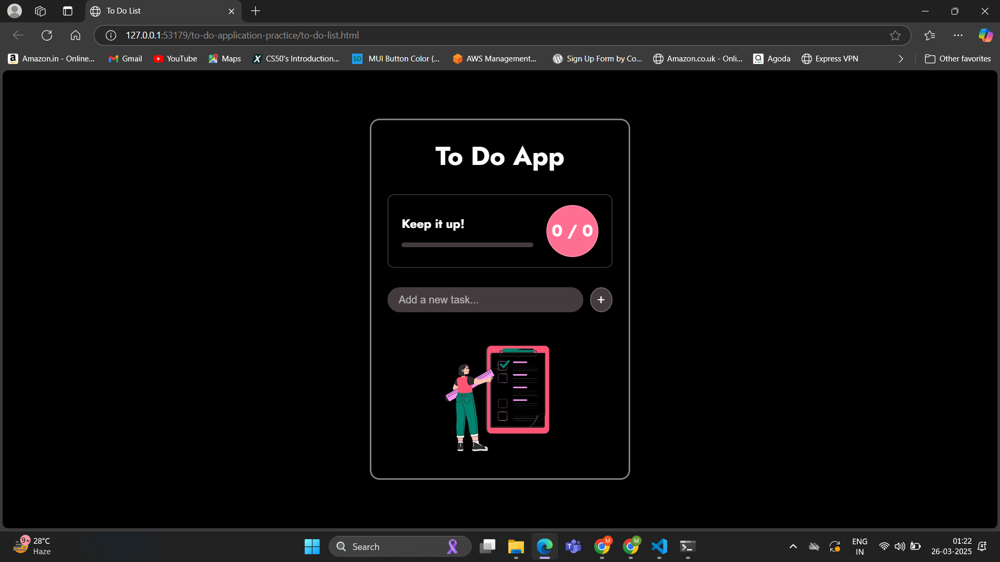
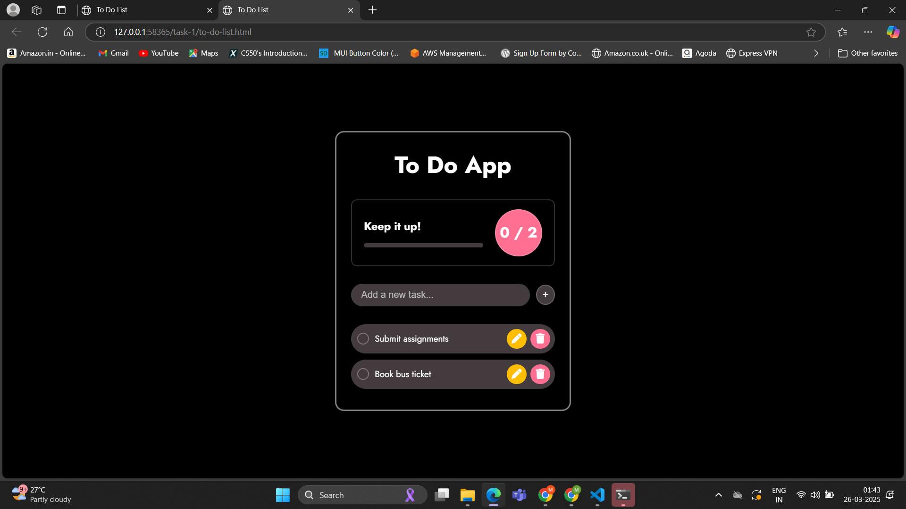
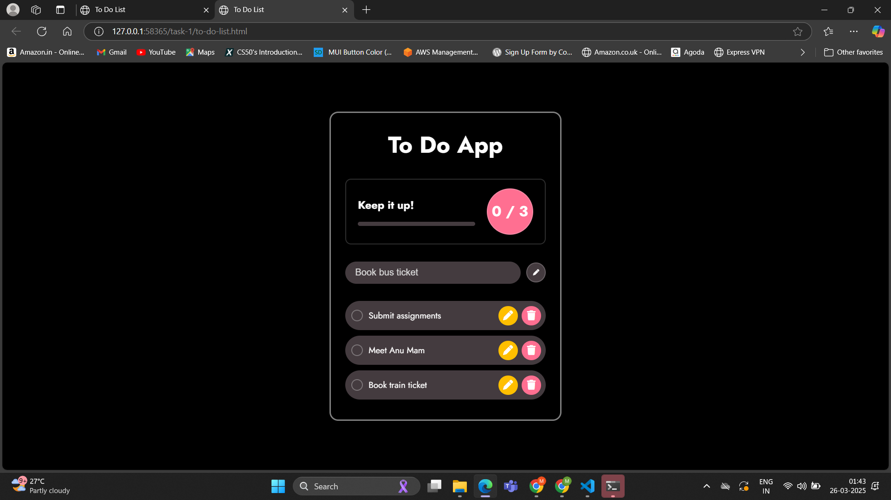
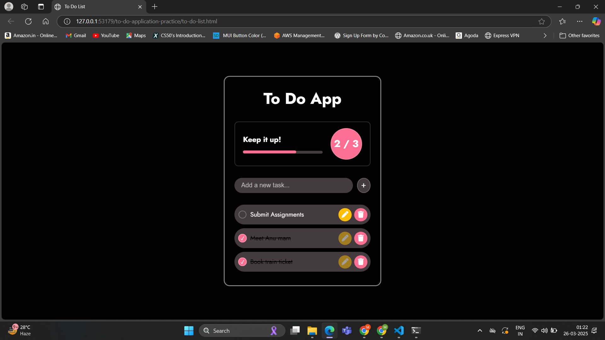
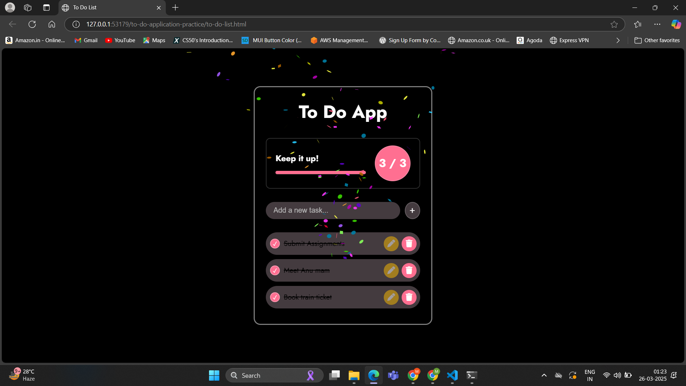

# Task 1- Interactive To-Do List Application

## Objectives:
A simple to-do list app where users can:
- Add new tasks.
- Mark tasks as complete.
- Remove tasks.

## Requirements:
- Use DOM manipulation to create, update, and delete list items.
- Attach event listeners for adding tasks and toggling their completion status.
- Optionally store tasks in an array (or even in `localStorage` for persistence).

## Outputs:

#### 1. Empty list
- An image when task-list is empty.

#### 2. Task input and Task list
- Input bar to add task.
- Task can be added by clicking the add button or hitting enter on keyboard.

#### 3. Delete the added task

#### 4. Edit the added task
- Edit the task in input bar.

#### 5. Mark task as complete (checked):
- Tasks that are completed are indicated by a line-through.
- A progress bar to track progress of completed tasks.

#### 6. Complete all tasks:
- A confetti blasts on completion of all tasks.

