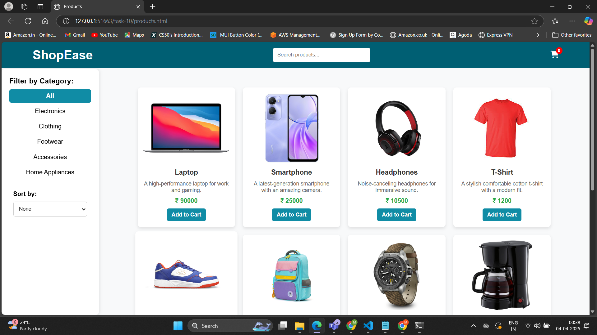
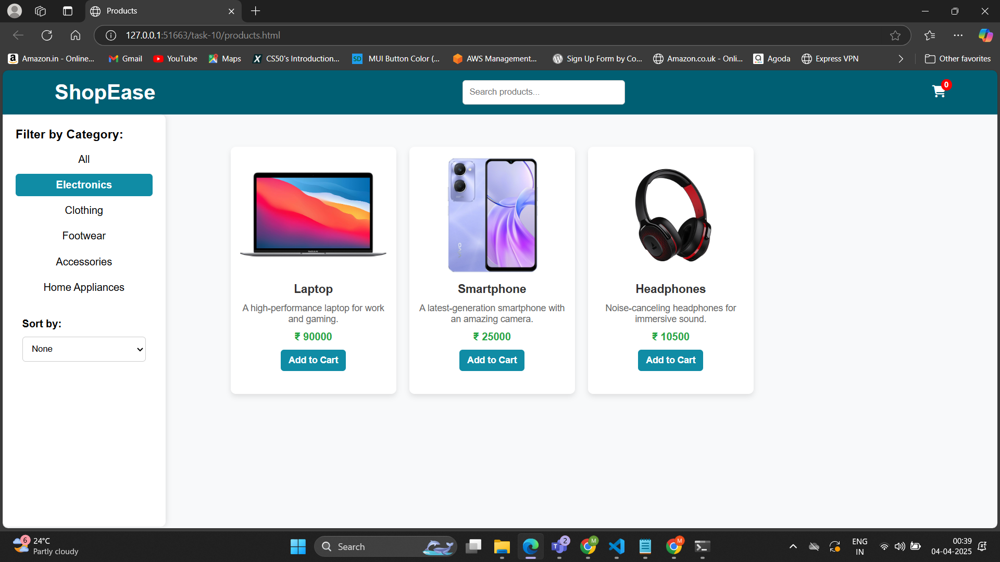
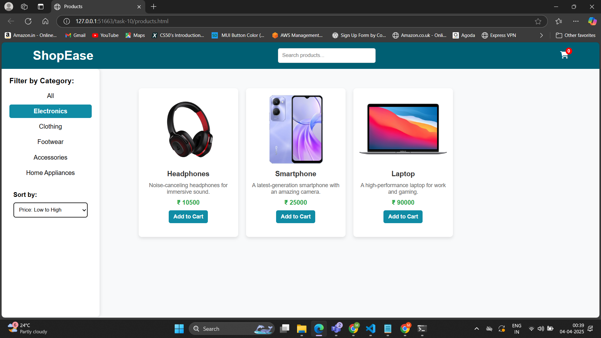
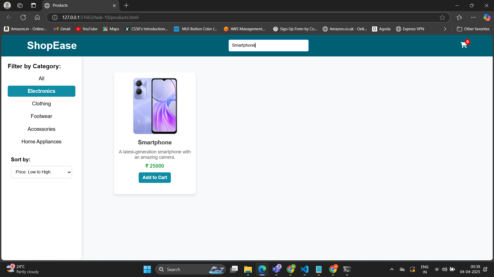
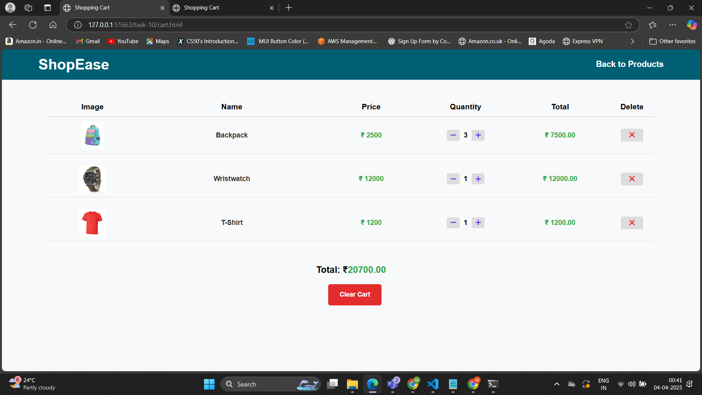

# Task 10. **Full-featured eCommerce Shopping Cart**

## **Objective:** 
- Build a comprehensive eCommerce simulation that includes product listings, a shopping cart, and dynamic price calculations.

## **Requirements:**
- **Product Listing:** Dynamically load and display product information (images, prices, descriptions) from a data source.
- **Shopping Cart:** Implement add-to-cart functionality, allowing users to adjust quantities and remove items.
- **State Management:** Use JavaScript to manage cart state and persist data using techniques like `localStorage`.
- **Price Calculations:** Dynamically compute totals, taxes, and discounts based on cart contents.
- **Product Filtering/Search:** Add features for filtering products by category or searching by keywords.
- **Responsive UI:** Ensure the interface adapts well to various screen sizes and devices.
- **Advanced Concepts:** Incorporate modular JavaScript (using ES6 modules), advanced error handling, and efficient DOM manipulation techniques.

## Implementation:
1. **Product Listing**
- Products are loaded dynamically from products.json and images, prices, and descriptions are displayed.

2. **Product Filtering/Search**
- Implemented category-based filtering (setCategory).
- Implemented search filtering (onInputChange).
- Implementd sorting (low-to-high, high-to-low prices).

3. **Shopping Cart**
- Users can add items to the cart, adjust quantities, and remove them.
- Cart is updated dynamically.

4. **State Management**
- Cart state is managed using JavaScript and persisted in localStorage.

5. **Price Calculations** 
- Subtotal is calculated dynamically.
- Tax (10%) and discount (5% if subtotal > ₹500) are applied.
- Final total is displayed in the cart total.

## Outputs:

#### Product Listing

#### Product Filtering (By Category)

#### Product Sorting (By price)

#### Product Search

#### Shopping Cart
