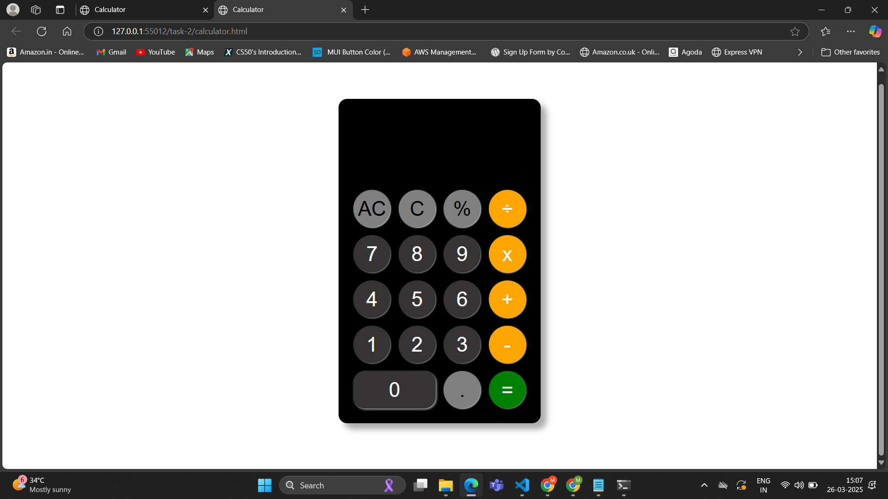
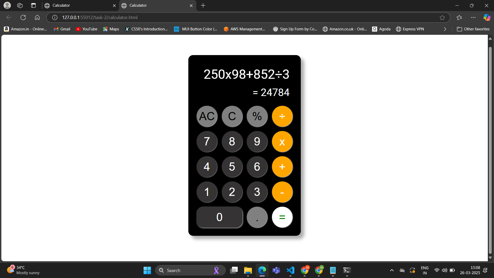

# Tsk - 2 **Simple Calculator**

## **Objective:** 
- Build a basic calculator that performs arithmetic operations like addition, subtraction, multiplication, and division.

## **Requirements:**
- Create number and operator buttons in HTML.
- Use JavaScript to capture user input and perform calculations.
- Update the display dynamically as the user interacts with the calculator.

## **Features:**
- **Basic Arithmetic Operations** – Supports addition (+), subtraction (-), multiplication (×), division (÷), and percentage calculations (%).

- **Dynamic Display Update** – Expressions and results are displayed in real-time.

- **Keyboard Support** – Users can enter numbers and operators using keyboard keys.

- **Expression Handling** 
  - Prevents starting expressions with an operator.
  - Automatically uses the result for a new operation after calculation.

- **Floating Point Precision Fix** – Handles JavaScript floating-point precision issues by rounding to 9 decimal places.

- **Multi-line Expression Display** – Prevents overflow by breaking long expressions into multiple lines instead of scrolling.

## Output:

