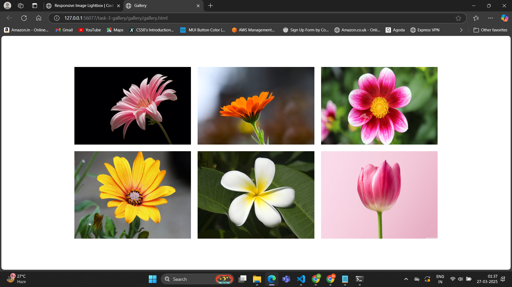
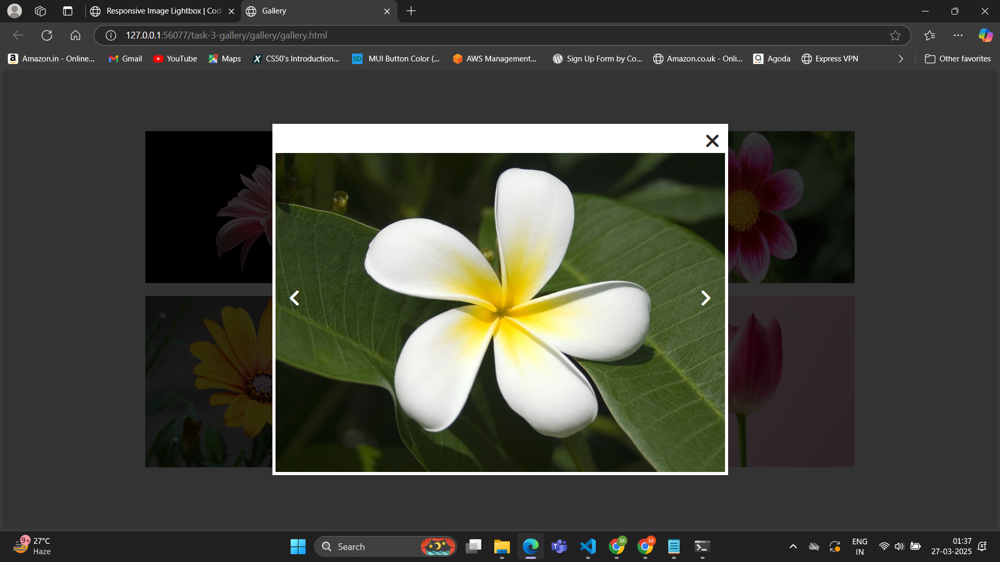

# Task 3 - **Image Gallery Lightbox**

## **Objective:** 
- Develop an image gallery where clicking a thumbnail opens a larger version in a modal/lightbox overlay.

## **Requirements:**
- Use event listeners to detect when a thumbnail is clicked.
- Dynamically update the modal content with the selected image.
- Toggle CSS classes to show/hide the modal and add transitions for smooth effects.

## **Features:**
- **Click Event:** Clicking on a thumbnail opens the image in a modal.
- **Lightbox Modal:** Enlarged image appears in a centered overlay.
- **Navigation Buttons:** Previous (<) and next (>) buttons allow easy browsing.
- **Close Button:** Click close button (X) to exit the modal.
- **Smooth Transitions:** CSS animations for scaling and fading effects.
- **Responsive Design:** Works seamlessly on different screen sizes.

## **Output:**

##### Gallery

#### Lightbox/Modal
