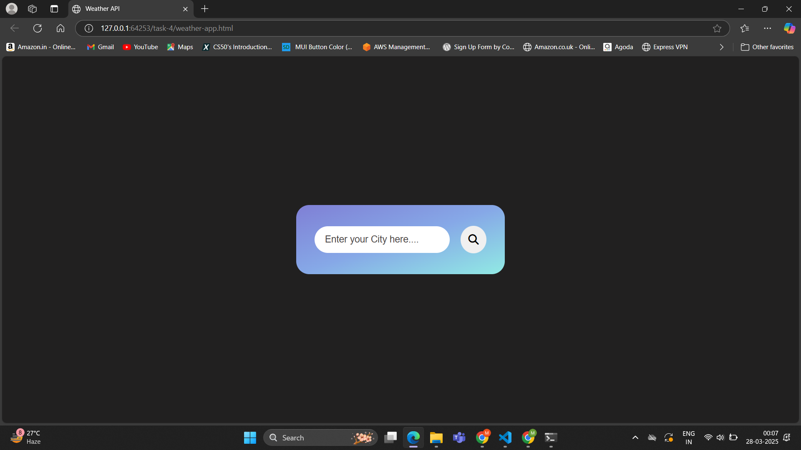
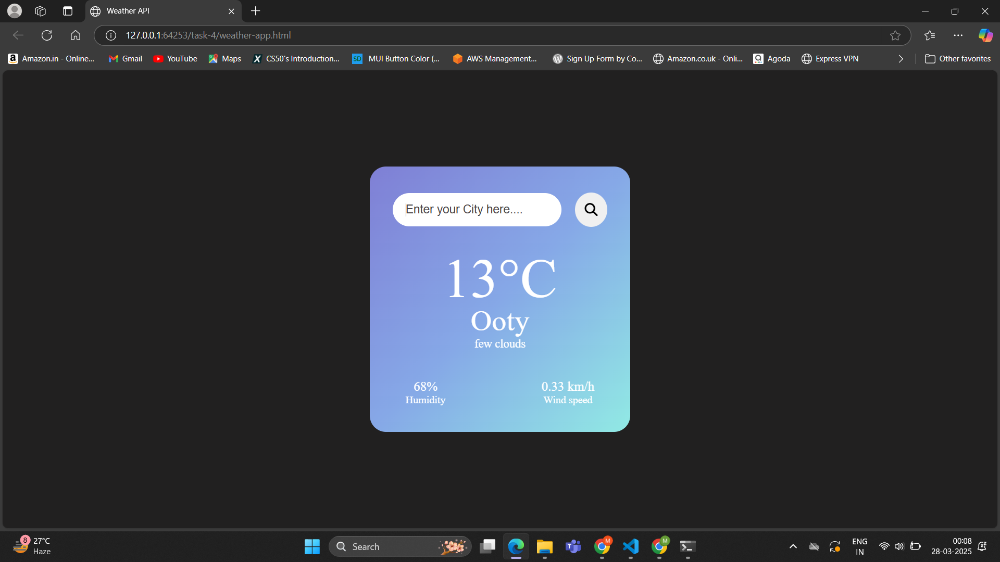

# Task 4 **Weather App with API Integration**

## **Objective:** 
- Create a weather app that fetches and displays weather information based on a city name input.

## **Requirements:**
- Use the Fetch API to retrieve weather data from a public API (e.g., OpenWeatherMap).
- Parse the JSON response and update the DOM with temperature, humidity, and weather conditions.
- Implement error handling for invalid input or failed network requests.

## **Features:**

- Fetches real-time weather data from the OpenWeatherMap API `https://api.openweathermap.org/data/2.5/weather?q={city}&appid={API_KEY}&units=metric`

- **Displays:**
    - Temperature in Celsius.
    - Weather description (e.g., Clear, Rainy, Cloudy).
    - Humidity percentage.
    - Wind speed in km/h.

- **Error handling for:**
    - Invalid city names.
    - Network failures.
    - API errors like invalid API keys or rate limits.

- Users can search by clicking the search button or pressing Enter.

## **Outputs:**

#### Input box for city with search button

#### Weather info

#### Error handling:

