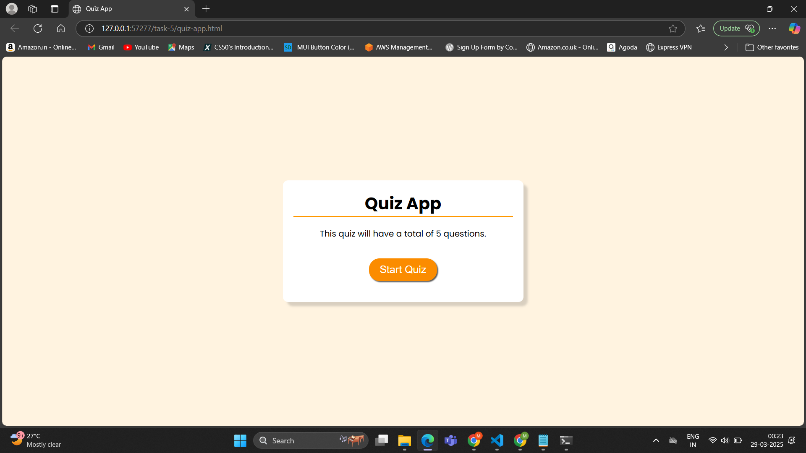
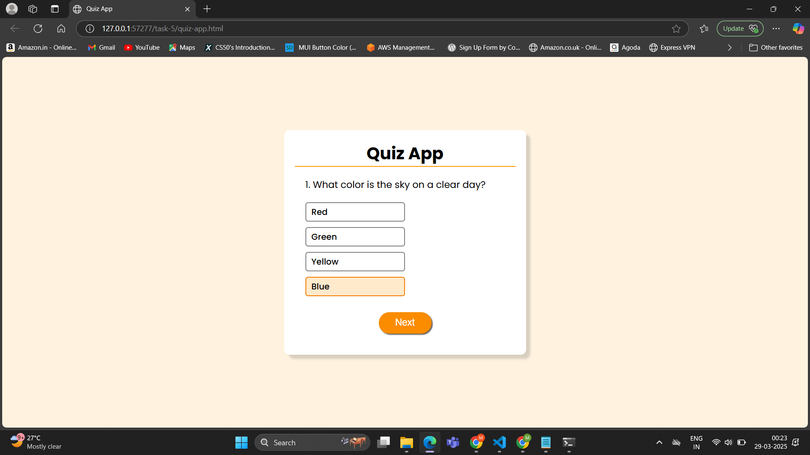
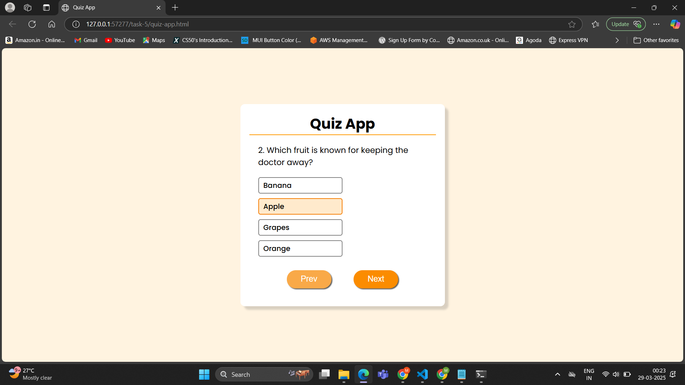
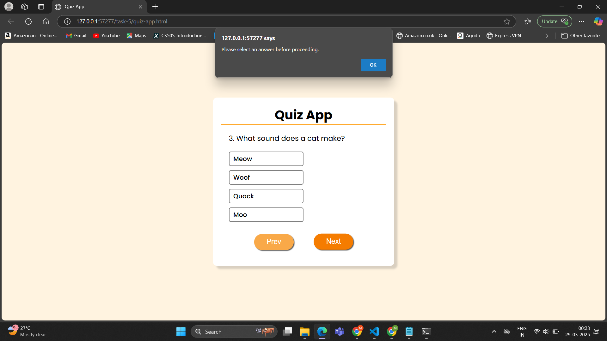

# Dynamic Quiz Application

## **Objective**
- Build a quiz app that dynamically loads questions and tracks user scores.

## **Requirements**
- Store quiz questions and options in a JavaScript object or load them from an external JSON file.
- Use event listeners to capture user selections and move through quiz questions.
- Calculate and display the final score, providing feedback or explanations as needed.

## **How It Works (Technical Overview)**

#### **Quiz Initialization**
- The "Start Quiz" button triggers a fetch request to load questions from a JSON file.
- The fetched data is stored in an array, and the first question is displayed.

#### **User Interaction Handling**
- Each option is generated dynamically and assigned a change event listener.
- When a user selects an option, their choice is stored in an object (`selectedAnswers`).

#### **Navigation System**
- "Next" and "Prev" buttons update `currentIndex` and re-render the question.
- If no answer is selected, an alert prevents the user from proceeding.
- Previously selected answers are restored when revisiting a question.

#### **Score Calculation & Submission**
- On submission, the app iterates through `selectedAnswers` and compares responses with correct answers.
- The score is calculated and displayed, replacing the quiz interface.

#### **Restart Mechanism**
- Clicking "Restart" resets all variables (`currentIndex`, `selectedAnswers`, `score`) and reloads the quiz.

## **Outputs**

#### Quiz App

#### Question Screen

#### User Selection

#### Alert

#### Score Display

