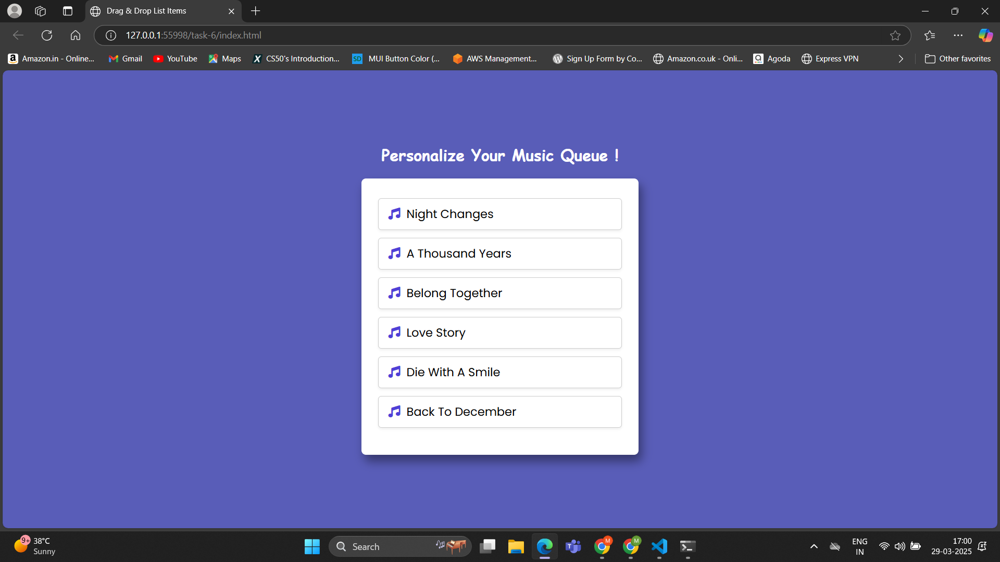
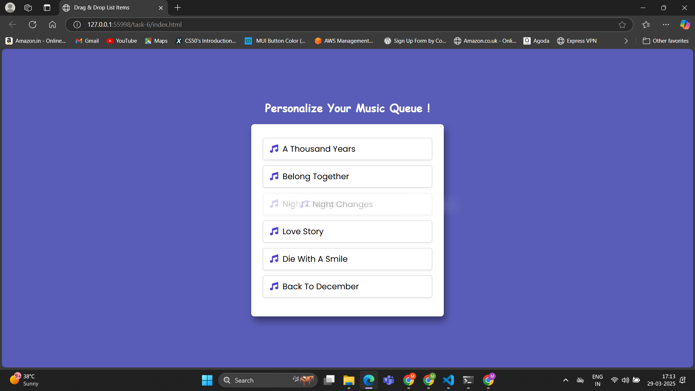

# Task 6 - **Drag and Drop List Reordering**
    
## **Objective:** 
- Implement a list that allows users to reorder items using drag and drop functionality.

## **Requirements:**
- Leverage the HTML5 Drag and Drop API to manage drag events.
- Update the DOM to reflect the new order of items after a drop.
- Provide visual feedback during drag operations (e.g., highlight potential drop targets). 

## **Features:**
- Drag and Drop Support: Users can reorder list items effortlessly.
- Visual Feedback: Highlighting the item being dragged.
- Automatic List Update: The list reorders dynamically when an item is dropped.

## **How It Works:**

#### 1. Dragging an Item:
- When a user starts dragging a list item, the `dragstart` event fires.
- The dragged item is stored in a variable (draggedItem).
- The item gets a CSS class (dragging) for visual feedback.

#### 2. Dropping an Item:
- The `dragend` event removes the dragging class after the drop.
- The dragover event prevents default behavior to allow dropping.

#### 3. Determining Drop Position:
- getDragAfterElement() finds the closest element where the dragged item should be placed.
- It calculates the vertical position of the mouse (e.clientY) relative to other items.
- The function loops through all list items that are not currently being dragged (li:not(.dragging)).
- For each item, it calculates an offset using the formula:
 
  `offset = y - box.top - box.height / 2;`

- If the offset is negative, the dragged item is above the list item.
- If the offset is positive, the dragged item is below the list item.
- The function selects the item closest to the dragged position and inserts the dragged item accordingly.

## **Key Terms:**

- **li:not(.dragging)** → Selects all list items except the one currently being dragged.

- **offset** → Measures how far the mouse pointer is from the midpoint of a list item.

- **box.top** → Gets the distance from the top of the viewport to the list item.

- **box.height / 2** → Divides the item's height by 2 to determine its midpoint.

- **getBoundingClientRect()** → Provides position and size of an element relative to the viewport.

## **Outputs:**

#### Before dragging :

#### While dragging :

#### After dragging :

