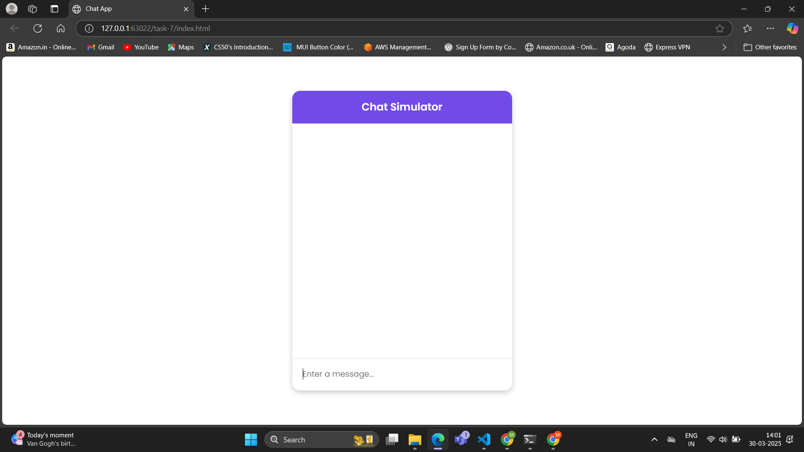
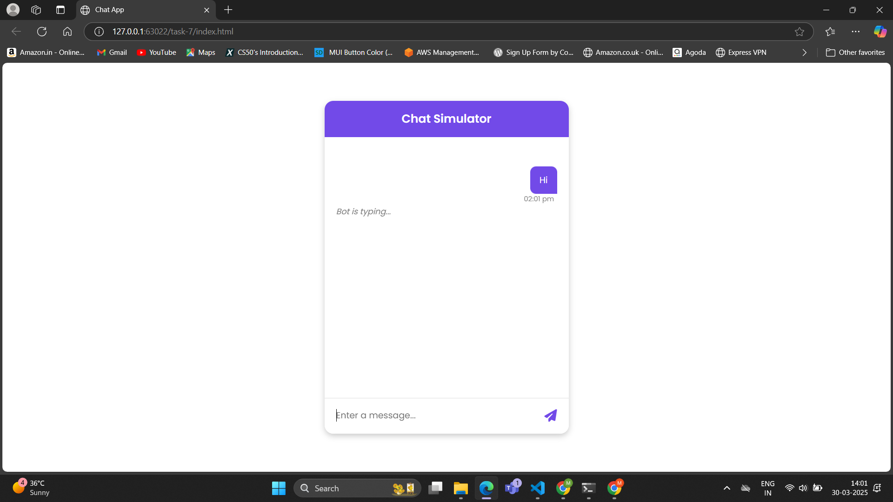
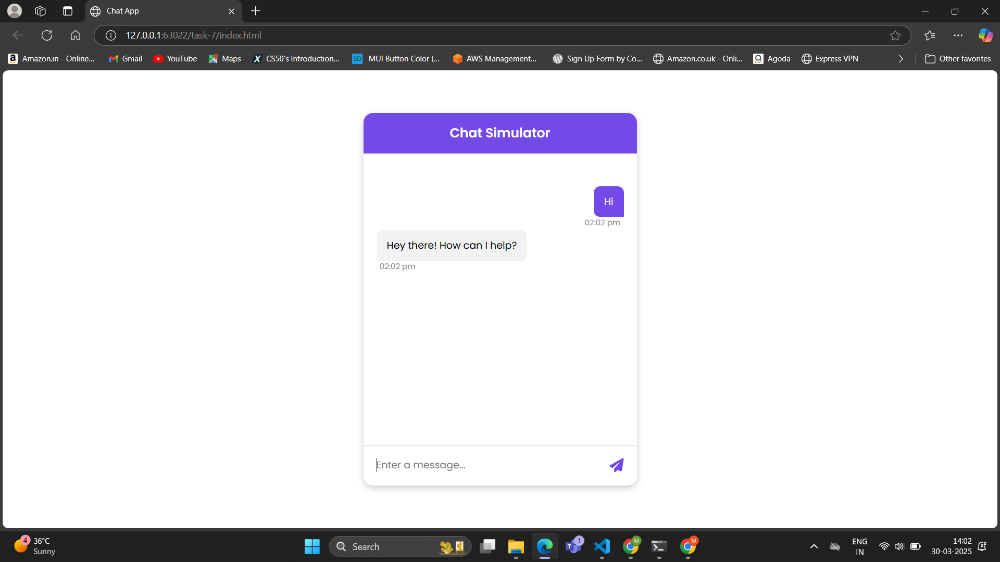
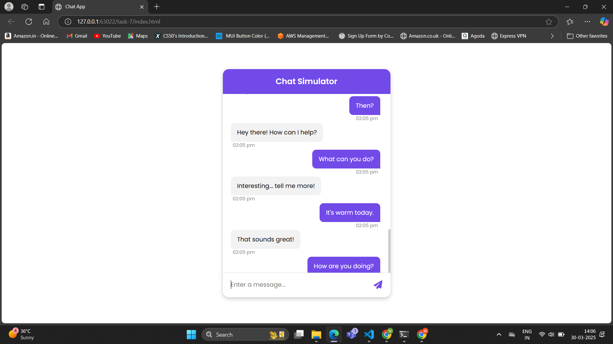

# Task - 7 **Real-time Chat Simulation**

## **Objective:** 
- Develop a chat interface that simulates real-time messaging without a backend.

## **Requirements:**
- Create a chat window that displays messages as they are sent.
- Use `setTimeout` or `setInterval` to simulate incoming messages.
- Handle user input, display timestamps, and update the conversation dynamically.

## **Features:**
- Chat Window: Displays messages as they are sent.
- Simulated Bot Responses: Uses setTimeout to mimic real-time replies.
- Timestamps: Each message includes a timestamp.
- Auto-scroll: Ensures new messages are always visible.

## **How it Works?:**

#### 1. **User Input Handling**
- The textarea listens for input events.
- The send button becomes visible when the user starts typing.
- When the user clicks the send button or presses Enter (without Shift), the message is processed.

#### 2. **Message Processing:**
- The user message is added as a 
 inside the chat window.
- A *timestamp* is added using JavaScript’s `Date object`.
- The textarea height is adjusted dynamically using `scrollHeight`.
- The chat window auto-scrolls to the latest message using `scrollTop`.

#### 3. **Simulated Bot Response:**
- A "Bot is typing..." indicator is displayed.
- The `setTimeout()` is used to simulate a delay before the bot responds.
- A random bot response is selected using Math.random().
    - The function Math.random() generates a decimal between 0 and 1.
    - Multiplying by the length of the bot responses array (botResponses.length) gives a random index.
    - Math.floor() rounds down to the nearest whole number to select a valid index.
- The selected response is then appended to the chat window.
- The chat window scrolls to ensure the new message is visible.

## **Outputs:**

##### Chat App:

##### User Message:

#####  Bot response:

##### Chat Window:

