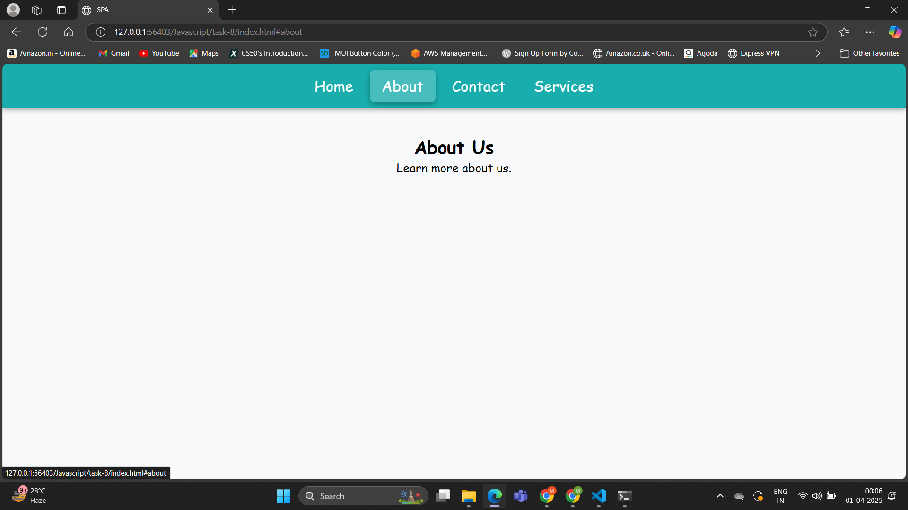

# Task 8 **Single-Page Application (SPA) with Hash-based Routing**

## **Objective:** 
- Build a basic SPA that navigates between different views without reloading the page.
    
## **Requirements:**
- Implement hash-based routing by listening to the `window.onhashchange` event.
- Dynamically load different content sections based on the current URL hash.
- Maintain a consistent UI and state across route changes.

## **Implementation:**

- The navigation menu contains links like `<a href="#home">Home</a>` that change the URL hash when clicked.
- A JavaScript object, routes, stores the HTML content for different sections.
- The `loadContent()` function reads the hash from the URL and updates the #content div dynamically.
- The `window.onhashchange` event detects hash changes and calls loadContent() to update the content.
- The active navigation link is updated by adding/removing an `.active` class based on the current hash.

## **Outputs:**

#### Home

#### About

#### Contact

#### Services

