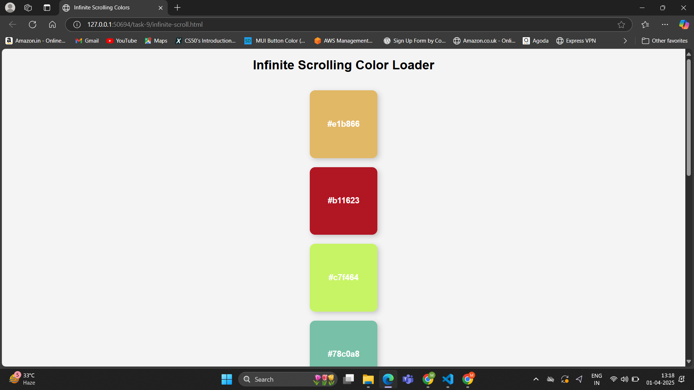
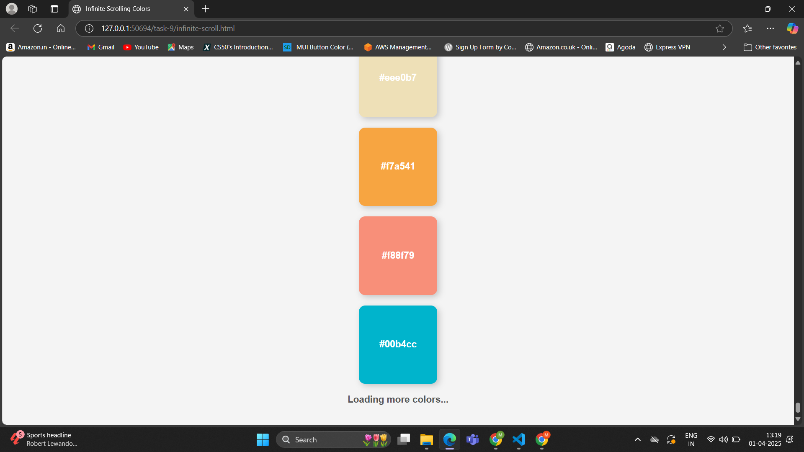
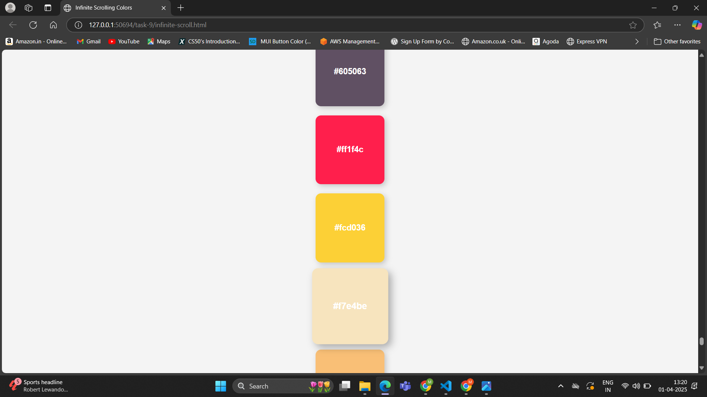

# Task 9 **Infinite Scrolling Content Loader**

## **Objective:** 
- Create a web page that loads additional content as the user scrolls toward the bottom.

## **Requirements:**
- Detect when the user is near the bottom of the page using the scroll event.
- Use the Fetch API to load more data asynchronously (simulate with dummy data or an API).
- Append new content to the page while ensuring smooth performance and user experience.

## **Implementation:**

1. When the user scrolls down the page, the `handleScroll` function is triggered by the `scroll` event listener attached to the window.
2. `handleScroll` calls the `isNearBottom` function to check if the user is near the bottom of the page.
3. If the user is near the bottom, `fetchColors` is called to fetch additional content (colors).
4. Inside `fetchColors`, it first checks if a request is already in progress using the `isLoading` flag. If `isLoading` is `true`, the function returns without making a new request.
5. If no request is ongoing, `isLoading` is set to `true`, and a loading indicator is displayed by changing `loading.style.display`.
6. A fetch request is made to the API (`fetch` function), requesting 10 random colors.
7. Once the fetch is successful,the colors are added to the page by creating a new `
` element fo each color, and appending them to the container (`container.appendChild`). 
8. After the colors are added, `isLoading` is reset to `false`, and the loading indicator is hidden by changing `loading.style.display`.
9. If no colors are available (empty array in the response), the scroll event listener is removed with `window.removeEventListener('scroll', handleScroll)`, and no further content is loaded.
10. The user continues to scroll, and the process repeats as long as the user is near the bottom of the page and new colors are available to load.

## **Outputs:**

##### Initial Set of Colors Loaded on the Page:

##### Loading Indicator Displayed as User Reaches the Bottom of the Page:

##### New Colors Loaded and Displayed on the Page:

